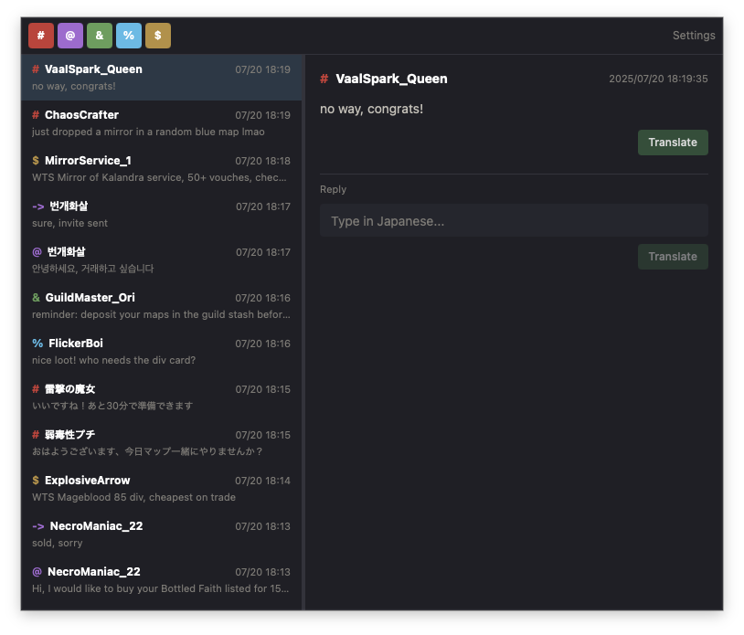
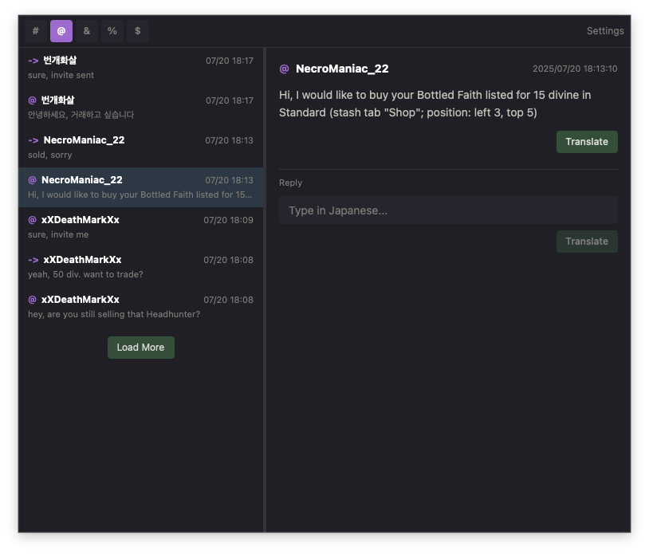
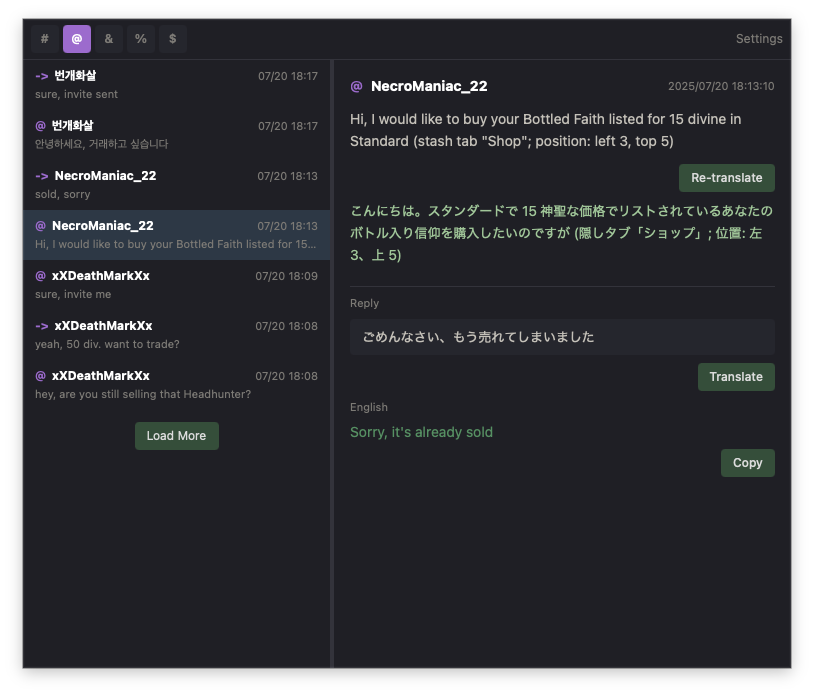
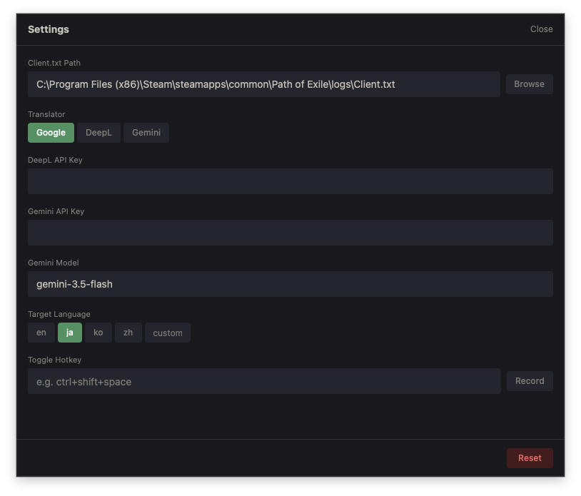

# PoE Chat Assistant

A desktop application that monitors Path of Exile chat logs in real time with built-in translation support.

Communicate smoothly with players around the world.

## Download

Download the latest version from [GitHub Releases](https://github.com/hirahiragg/poe-chat-assistant/releases/latest):

- **Windows**: `PoE.Chat.Assistant_x.x.x_x64-setup.exe`
- **macOS (Apple Silicon)**: `PoE.Chat.Assistant_x.x.x_aarch64.dmg`
- **macOS (Intel)**: `PoE.Chat.Assistant_x.x.x_x64.dmg`
- **Linux**: `poe-chat-assistant_x.x.x_amd64.deb` / `.AppImage`

Just download, run, and point the app to your Client.txt.



## Features

### Chat Log Viewer

Monitors Client.txt in real time and displays chat messages automatically. Filter by channel: Global, Whisper, Party, Guild, and Trade.



### Translation

Translate incoming messages with one click. Type a reply, translate it, and copy it directly into PoE. For Whisper messages, `@PlayerName` is automatically prepended on copy.



Three translation engines to choose from:

- **Google Translate**: No API key required, works out of the box
- **DeepL**: High-quality translation (API key required)
- **Gemini**: Context-aware translation with PoE terminology (API key required)

### Settings

Settings are auto-saved on change. Select the Client.txt path via a native file dialog. Configure the global hotkey by pressing Record and typing your desired key combination.



### Global Hotkey with PoE Focus Detection

Toggle the window with a configurable hotkey. Like Awakened PoE Trade, the hotkey is only active when PoE (or the assistant itself) is in the foreground: no conflicts with other applications.

### Resizable Split Pane

Drag the border between the message list and detail pane to adjust the layout.

## Getting Started

### Prerequisites

- [Node.js](https://nodejs.org/) v18+
- [Rust](https://rustup.rs/) 1.70+

### Install

```bash
git clone https://github.com/hirahiragg/poe-chat-assistant.git
cd poe-chat-assistant
npm install
```

### Development

```bash
npm run tauri dev
```

### Build

```bash
npm run tauri build
```

Build artifacts are generated in `src-tauri/target/release/bundle/`.

### Release

Push a version tag to trigger a GitHub Actions build for Windows (exe) and macOS (dmg):

```bash
git tag v0.1.0
git push origin v0.1.0
```

Binaries are automatically uploaded to [GitHub Releases](https://github.com/hirahiragg/poe-chat-assistant/releases).

## Configuration

Settings are stored in the OS standard config directory:

| OS      | Path                                                         |
| ------- | ------------------------------------------------------------ |
| Windows | `%APPDATA%\poe-chat-assistant\config.json`                   |
| macOS   | `~/Library/Application Support/poe-chat-assistant/config.json` |
| Linux   | `~/.config/poe-chat-assistant/config.json`                   |

### Default Client.txt Path

```
C:\Program Files (x86)\Steam\steamapps\common\Path of Exile\logs\Client.txt
```

On macOS / Linux, set the path manually in Settings.

## Test Data

`testdata/Client.txt` contains sample chat logs covering all channels (Global / Whisper / Party / Guild / Trade). Point the Client.txt path in Settings to this file to try out the app without a real PoE installation.

## Tech Stack

- **Frontend**: React, TypeScript, Tailwind CSS
- **Backend**: Rust, Tauri v2
- **Translation**: Google Translate / DeepL API / Gemini API

## License

MIT
